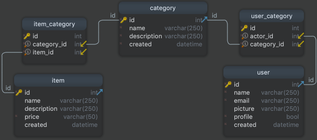

# Items & Categories Project

## Description   
Provides a list of items within a variety of categories as well as provide a user registration and authentication system. Registered users will have the ability to post, edit and delete their own items.
This is a dynamic website with persistent data storage to create a web application that provides ac compelling service to th users.   
 
## Languages, Frameworks & Style Sheets 

| Item                      | Description  |
|:---                       |:---          |
| Frameworks                | Bootstrap    | 
| Languages                 | Python 3     |
| Protocols                 | HTTP, TCP    |
| Markup Language           | HTML         |
| Object Relational Mapper  | SQLAlchemy   |
| Stylesheets Languages     | CSS          |
| Version Control           | Git, GitHub  |
| Web Application Framework | Flask        |

## DB Structure   

| Table         |Description                                                               |
|:---           |:---                                                                      |
| User          | User data table                                                          |
| Category      | Category data table                                                      |
| Item          | Item data table                                                          |
| User_Category | Table for many-to-many relationship between `User` and `Category` tables |
| Category_Item | Table for many-to-many relationship between `Item` and `Category` tables |

### `user` Table   

| Name    | Details                     | Description              |
|:---     |:---                         |:---                      |
| id      | int AUTO_INCREMENT unsigned | Unique `user` identifier |
| name    | varchar(250)                | `user` name              |
| email   | varchar(250)                | `user` email             |
| picture | varchar(250)                | `user` picture path      |
| profile | bool                        | `user` profile           |
|         |                             | `0`: user                |
|         |                             | `1`: admin               |
| created | datetime                    | `user` creation date     |
 
### `category` Table   

| Name        | Details                     | Description                  |
|:---         |:---                         |:---                          |
| id          | int AUTO_INCREMENT unsigned | Unique `category` identifier |
| name        | varchar(250)                | `category` name              |
| description | varchar(250)                | `category` description       |
| created     | datetime                    | `category` creation date     |

### `item` Table   

| Name        | Details                     | Description              |
|:---         |:---                         |:---                      |
| id          | int AUTO_INCREMENT unsigned | Unique `item` identifier |
| name        | varchar(250)                | `item` name              |
| description | varchar(250)                | `item` description       |
| price       | varchar(15)                 | `item` price             |
| created     | datetime                    | `item` creation date     |

### `item_category` Table    

| Name        | Details | Description                                |
|:---         |:---     |:---                                        |
| category_id | int     | Foreign Key - Unique `category` identifier |
| item_id     | int     | Foreign Key - Unique `item` identifier     | 

### `user_category` Table    

| Name        | Details | Description                                |
|:---         |:---     |:---                                        |
| category_id | int     | Foreign Key - Unique `category` identifier |
| user_id     | int     | Foreign Key - Unique `user` identifier     |

This is the Database Structure, and its relationships:   

